# Notification Center Documentation

## System Flow Diagram
The notification system consists of three main flows: the Publishing Flow, the Retrieval Flow, and the Automated Scheme Notification Flow. Each component corresponds to specific functionality documented in later sections.

```mermaid
flowchart TD
    subgraph "Publishing Flow"
        A[User Action] -->|Triggers| B[publishMessage]
        B -->|Publishes to| C[notificationCenter Topic]
        C -->|Triggers| D[Cloud Function]
        D -->|Process Event| E{Event Type}
        E -->|likesOnPost| F1[Handle Post Likes]
        E -->|likesOnComment| F2[Handle Comment Likes]
        E -->|commentOnPost| F3[Handle Post Comments]
        E -->|follow| F4[Handle Follows]
        E -->|commentOnMandiPost| F5[Handle Mandi Comments]
        
        F1 & F2 & F3 & F4 & F5 -->|Update| G[Firebase DB]
        F1 & F2 & F3 & F4 & F5 -->|Send| H[External API]
    end

    subgraph "Retrieval Flow"
        I[Client Request] -->|Triggers| J[getNotifications Function]
        J -->|Fetch| K1[Chat Notifications]
        J -->|Fetch| K2[Global Notifications]
        J -->|Fetch| K3[Social Notifications]
        J -->|Fetch| K4[Geographic Notifications]
        
        K1 & K2 & K3 & K4 -->|Merge & Sort| L[Combined Feed]
        L -->|Track| M[Mixpanel Analytics]
        L -->|Return| N[Client Display]
        
        O[Read Status Update] -->|Triggers| P[updateNotifications]
        P -->|5s Delay| Q[Update Last Read]
    end

    subgraph "Automated Scheme Notification Flow"
        R[Cloud Scheduler] -->|Daily Trigger| S[schemes_daily_pns]
        S -->|Fetch Posts| T[MySQL Database]
        T -->|Filter & Process| U[Top Liked Posts]
        U -->|For Each State| V{State Processing}
        V -->|Create Notification| W[Webengage Service]
        W -->|Send| X[User Segments]
    end
```

<details>
<summary>Click to expand the Notification Center Flow Diagram</summary>



</details>

> **Note**: This diagram is rendered using [Mermaid](https://mermaid.js.org/). GitHub automatically renders Mermaid diagrams in Markdown files. If you're viewing this on another platform, you may need to use a Mermaid-compatible viewer.

### Publishing Flow Components
1. **User Action (A)**
   - Corresponds to user interactions documented in [Notification Types](#notification-types) section
   - Examples: likes, comments, follows

2. **Message Publishing (B → C)**
   - Detailed in [Publishing Messages](#publishing-messages) section
   - Uses the following format:
   ```javascript
   publishMessage('notificationCenter', JSON.stringify({...objectToSave, type: 'commentOnPost'}), pubSubClient);
   ```

3. **Event Processing (D → E)**
   - Handled by Cloud Functions described in [Architecture](#architecture) section
   - Routes events to appropriate handlers based on type

4. **Event Handlers (F1 → F5)**
   - Implementation details found in [Data Structure](#data-structure) section
   - Each handler processes specific notification types

5. **Storage and API (G, H)**
   - Firebase DB operations detailed in [Unread Notifications Counter](#unread-notifications-counter) section
   - External API calls documented in [API Integration](#api-integration) section

### Retrieval Flow Components
1. **Client Request (I)**
   - Initiates notification fetch process
   - Triggers `getNotifications` function

2. **Notification Sources (K1 → K4)**
   - Details in [Getting Notifications](#getting-notifications) section
   - Includes:
     - Chat notifications
     - Global notifications
     - Social notifications
     - Geographic notifications

3. **Feed Generation (L)**
   - Process described in [Notification Sorting and Merging](#notification-sorting-and-merging) section
   - Combines multiple notification sources
   - Applies sorting and relevance rules

4. **Analytics and Display (M, N)**
   - Analytics integration detailed in [Analytics Integration](#analytics-integration) section
   - Client display guidelines in [Best Practices](#best-practices) section

5. **Read Status Management (O → Q)**
   - Process documented in [Unread Status Management](#unread-status-management) section
   - Includes delay mechanism for processing

## Overview
The Notification Center is responsible for handling various types of user interactions and sending appropriate notifications. It uses Google Cloud Pub/Sub for message publishing and Firebase for data storage and real-time updates.

## Architecture
- **Publisher**: Services publish messages to the 'notificationCenter' topic
- **Subscriber**: Cloud Function handles the published messages and processes different notification types
- **Storage**: Uses Firebase Realtime Database and Firestore
- **External API**: Notifications are sent to an external API endpoint (kc.retailpulse.ai)

## Notification Types
The system handles the following types of notifications:

1. **Post Likes** (`likesOnPost`)
   - Triggered when a user likes a post
   - Updates unread notification counter for post owner
   - Sends notification with liker's details

2. **Comment Likes** (`likesOnComment`)
   - Triggered when a user likes a comment
   - Updates unread notification counter for comment owner
   - Includes comment content in notification

3. **Post Comments** (`commentOnPost`)
   - Triggered when a user comments on a post
   - Differentiates between direct comments and replies
   - Truncates comments longer than 100 characters

4. **Comment Replies** (`commentOnPost` with `is_reply: true`)
   - Handles replies to existing comments
   - Updates notification counter for parent comment owner
   - Includes truncated reply content

5. **User Follows** (`follow`)
   - Triggered when a user follows another user
   - Updates notification counter for followed user
   - Includes follower's profile information

6. **Mandi Post Comments** (`commentOnMandiPost`)
   - Similar to regular post comments but specific to Mandi posts
   - Handles both direct comments and replies
   - Uses same truncation rules as regular comments

## Publishing Messages
To publish a notification event, use the following format:

```javascript
publishMessage(
    'notificationCenter',
    JSON.stringify({
        ...objectToSave,
        type: 'commentOnPost' // Notification type
    }),
    pubSubClient
);
```

## Data Structure
Each notification type requires specific data fields:

### Post Like Notification
```javascript
{
    news_id: string,
    post_user_id: string,
    liker_user_id: string,
    liker_user_name: string,
    liker_user_pic: string,
    created_at: timestamp
}
```

### Comment Notification
```javascript
{
    news_id: string,
    post_user_id: string,
    comment: string,
    commenter_user_id: string,
    commenter_user_name: string,
    commenter_user_pic: string,
    created_at: timestamp,
    comment_id: string (optional)
}
```

### Follow Notification
```javascript
{
    followee_user_id: string,
    follower_user_id: string,
    follower_user_name: string,
    follower_user_pic: string,
    created_at: timestamp
}
```

## Unread Notifications Counter
- Each notification updates the recipient's unread notification counter
- Counter is stored in Firebase at path: `/users/${userId}/no_of_unread_notifications`
- Uses Firebase's `ServerValue.increment(1)` for atomic updates

## Error Handling
- Each notification type has its own try-catch block
- Failed notification counter updates are logged but don't stop the notification flow
- API call failures are captured and logged

## Profile Image Handling
The system includes a utility function `getWebpUrls()` that:
- Converts regular image URLs to WebP format
- Handles both KPL and thumbnail path conversions
- Falls back to a default dummy profile picture if no image is provided

## API Integration
Notifications are sent to external endpoints:
- Base URL: `https://kc.retailpulse.ai/api`
- Endpoints:
  - `/postLikes`
  - `/comment`
  - `/reply`
  - `/follow`
  - `/mandiComment`
  - `/mandiCommentReply`

## Environment Configuration
The system supports multiple environments:
- Production: Uses `productionApp` Firebase instance
- Staging: Uses `stageApp` Firebase instance
- Meta: Uses `metaApp` Firebase instance for metadata

## Notification Retrieval Flow

## Getting Notifications
The system provides a cloud function `getNotifications` that fetches notifications from multiple sources:

1. **Chat Notifications**
   - Fetched from `/p2p/unreadMessages/{userId}`
   - Includes information about last message sender and unread count
   - Chat notifications appear with a special 'p2p' tag

2. **Global Notifications**
   - Retrieved from `/notificationCenter/global`
   - Version-dependent (disabled for app versions >= 5.9.0)
   - Sorted by creation timestamp

3. **Social Notifications**
   - Fetched via `/allNotifications` endpoint
   - Supports multiple notification types:
     - Mandi comments and replies
     - Post likes
     - Comment likes
     - Post comments
     - Reply notifications
     - Follower activities
     - Published posts

4. **Geographic Notifications**
   - Based on user's city and cluster
   - Retrieved from `/userProfile/{uid}/district` and `/userProfile/{uid}/geo_coded_cluster`

## Notification Sorting and Merging
1. **Priority Based Placement**
   - Social notifications with relevance scores are placed first
   - Other notifications are filled in remaining slots
   - Chat notifications are appended at the end

2. **Timestamp Sorting**
   - All notifications are sorted by `created_at` timestamp
   - Most recent notifications appear first

## Unread Status Management
- System tracks last read time at `/notificationCenter/users/{uid}/readTime`
- Notifications created after last read time are marked as unread
- Unread count is calculated and returned with notifications
- Updates user's unread message count via `updateUnreadMsgCount`

## Analytics Integration
- Mixpanel events are tracked for notification delivery
- Event "Notifications Pushed In Notification Center" includes:
  - User ID (distinct_id)
  - Full notification payload

## Notification Update Function
The system provides `updateNotifications` function that:
- Takes a readTime parameter
- Updates the user's last read timestamp
- Includes a 5-second delay for processing
- Updates notification read status in the database

## Error Handling
- Each notification source fetch has independent error handling
- System returns empty array with default header on errors
- Failed fetches don't block other notification types

# Automated Scheme Notifications

## Overview
The system includes an automated notification service for scheme-related posts, implemented through the `schemes_daily_pns` Cloud Function. This service automatically sends notifications about scheme posts to users based on their state and engagement metrics.

## Flow Process
1. **Trigger**: Cloud Function runs daily to process scheme notifications
2. **Data Collection**:
   - Fetches state-level scheme posts from the last 24 hours
   - Retrieves engagement metrics (likes, impressions)
   - Filters posts based on state-specific criteria

3. **Post Selection**:
   ```python
   def get_top_liked_posts(posts, cursor):
       # Calculates engagement metrics
       post_likes['like_rate'] = post_likes.no_of_likes/post_likes.no_of_impressions*100
       # Sorts and selects top performing posts
       post_likes = post_likes.sort_values('like_rate', ascending=False)
   ```

4. **State-wise Processing**:
   - Each state has configured:
     - Notification times (`STATE_NOTIF_TIMES_MAP`)
     - User segments (`STATE_SEGMENT_MAP`)
     - Number of daily notifications

5. **Notification Creation**:
   ```python
   def send_notification(title, body, kvPairs, segment_id, notif_time, campaign_name):
       payload = {
           'campaignType': 'Automated Scheme Notification',
           'segments': {
               'excludedSegments': EXCLUDED_SEGMENTS,
               'includedSegments': [segment_id]
           },
           'scheduledTime': pn_time,
           'titles': [title],
           'messages': [body]
       }
   ```

## Database Schema
The system utilizes two MySQL databases:
1. **Main Database**:
   - `posts` table: Contains post information
   - `post_cohorts` table: Maps posts to states/clusters
   - `post_interactions` table: Stores engagement metrics

2. **UGC Database**:
   - `ugc_posts` table: Contains user-generated content
   - `ugc_posts_stats` table: Stores post statistics

## Key Functions

### 1. Post Fetching
```python
def fetch_state_level_scheme_posts(cursor, cursor1):
    # Fetches posts from last 24 hours
    # Maps posts to states
    # Retrieves UGC content
```

### 2. Engagement Analysis
```python
def get_top_liked_posts(posts, cursor):
    # Calculates engagement metrics
    # Ranks posts by performance
    # Returns top performing content
```

### 3. Notification Dispatch
```python
def send_notification(title, body, kvPairs, segment_id, notif_time, campaign_name):
    # Creates notification payload
    # Schedules delivery
    # Handles targeting
```

## Error Handling
1. **Database Connections**:
   ```python
   def make_connection():
       # Handles MySQL connection setup
       # Manages connection lifecycle
       # Uses buffered cursors for efficiency
   ```

2. **Process Recovery**:
   - Checks connection status before operations
   - Reconnects if connection is lost
   - Closes connections properly after use

## Configuration
The system uses several configuration maps:
1. `STATE_NOTIF_TIMES_MAP`: Defines notification timings per state
2. `STATE_SEGMENT_MAP`: Maps states to user segments
3. `EXCLUDED_SEGMENTS`: Global exclusion list
4. `GENERIC_PN_DETAILS`: Fallback notification content

## Best Practices for Scheme Notifications
1. Monitor engagement metrics regularly
2. Update state segments based on user behavior
3. Rotate notification timings for optimal engagement
4. Test notification content across different states
5. Maintain fallback content for low-content days

# Best Practices
1. Always include error handling when publishing messages
2. Validate required fields before sending notifications
3. Keep comment content under 100 characters for better display
4. Ensure proper environment selection when deploying
5. Monitor notification counter updates for consistency
