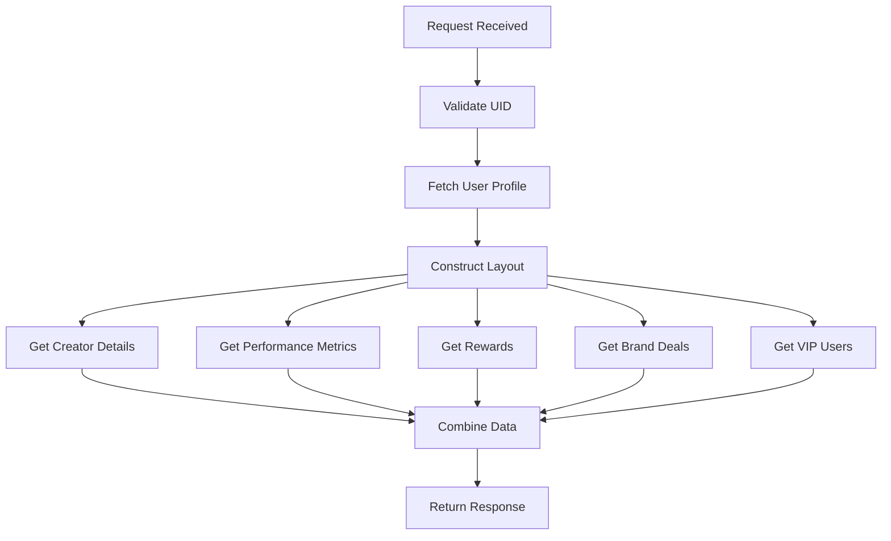
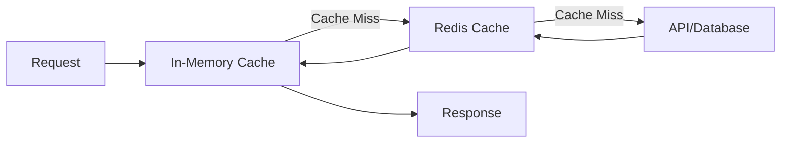

# Creator Dashboard Cloud Function Documentation

## Overview
This cloud function serves as the backend API for a creator dashboard application. It provides various endpoints to fetch and manage creator-related data, including performance metrics, brand deals, lottery tickets, and VIP creator information.

## Table of Contents
- [Environment Configuration](#environment-configuration)
- [API Endpoints](#api-endpoints)
- [Core Features](#core-features)
- [Business Logic and Core Functionality](#business-logic-and-core-functionality)
- [Data Models](#data-models)
- [Caching Strategy](#caching-strategy)
- [Dependencies](#dependencies)
- [Error Handling](#error-handling)

## Environment Configuration

The function supports multiple environments:
- Production
- Staging
- Meta (for metadata)

Each environment has its own Firebase configuration:
```javascript
const stageFirebaseDBUrl = "https://op-d2r-default-rtdb.asia-southeast1.firebasedatabase.app/";
const prodFirebaseDBUrl = "https://op-d2r-prod.asia-southeast1.firebasedatabase.app/";
const metaFirebaseDBUrl = "https://op-d2r-meta.asia-southeast1.firebasedatabase.app/";
```

## API Endpoints

The cloud function exposes several endpoints through a single HTTP callable function:

### 1. Creator Dashboard (type: "home")
```javascript
// Example request
{
  "type": "home",
  "uid": "user_id",
  "env": "stage" // optional, defaults to "stage"
}
```

### 2. Post Performance (type: "view_post_performance")
```javascript
{
  "type": "view_post_performance",
  "uid": "user_id",
  "limit": 10, // optional
  "lastItem": 0 // optional
}
```

### 3. Brand Collaboration Deals (type: "view_brand_colab_deals")
```javascript
{
  "type": "view_brand_colab_deals",
  "uid": "user_id",
  "limit": 5 // optional
}
```

### 4. Lottery Tickets (type: "view_lottery_tickets")
```javascript
{
  "type": "view_lottery_tickets",
  "uid": "user_id"
}
```

## Core Features

### 1. Creator Dashboard
- Performance metrics visualization
- VIP creator status tracking
- Brand deal opportunities
- Reward system integration
- Content performance analytics

### 2. User Geography Management
The system implements a sophisticated caching strategy for user geography data:
- Redis-based caching
- In-memory caching
- Fallback to API calls
- 30-hour TTL for cached data

### 3. Performance Indicators
Tracks various performance metrics:
- User performance score
- Performance indicator slab (gold, silver, bronze)
- Performance trend indicators
- Content quality metrics

### 4. Brand Deals
- Cohort-based targeting
- Geographic filtering
- Active deal tracking
- Deal performance metrics

## Business Logic and Core Functionality

### 1. Creator Dashboard Flow
The creator dashboard implements a complex workflow to display personalized content and metrics for creators:



#### Key Components

1. **Performance Calculation**
   - Tracks user's content performance over time
   - Calculates performance score based on multiple metrics
   - Determines VIP status and slab assignment (gold, silver, bronze)
   ```javascript
   performanceIndicatorScore > 90 ? "VIP" : "Regular"
   ```

2. **Brand Deals Selection**
   ```javascript
   const getBrandDeals = async (data, fs, uid) => {
     // Get user geography for targeting
     const userGeography = await getUserGeography(uid);
     
     // Build cohort based on geography
     let cohort = ["country:bharat"];
     if (userGeography?.geo_state) {
       cohort.push('state:' + userGeography.geo_state)
       cohort.push('district:' + userGeography.geo_district)
     }
     
     // Query relevant deals
     let snaps = fs
       .collection("brand_deals")
       .where("is_active", "==", 1)
       .where('cohort', "array-contains-any", cohort)
   ```

3. **Post Performance Analysis**
   - Analyzes last 14 days of posts
   - Categories: shop_tips, product_review, news, entertainment, new_product_launch
   - Performance scoring and VIP qualification
   ```javascript
   const lastxdayTs = getTsXdaysAgo(14);
   query += `AND p.post_performance_indicator_score >= 4`;
   ```

4. **Rewards System**
   - Tracks multiple reward types:
     - पूँजी (Punji/Capital): Weekly rewards
     - Lottery tickets: Performance-based rewards
   ```javascript
   case "punji":
     rewardItem = {
       reward_type: 1,
       heading: value,
       text: "पूँजी",
       sub_text: "(साप्ताहिक)",
     };
     break;
   ```

5. **VIP Creator Management**
   - Identifies top performers
   - Manages VIP benefits and status
   - Special content and opportunities
   ```javascript
   const getVipUsers = async () => {
     let query = `SELECT user_id FROM creator_performance_acts 
                  WHERE slab_tag IN ("BRONZE", "SILVER", "GOLD") 
                  AND is_active = 1`;
   ```

### 2. Caching and Data Flow



### 3. Geographic Targeting System

The system implements a hierarchical geographic targeting approach:
```
Country Level
   └── State Level
       └── District Level
```

Each level provides more specific targeting for:
- Brand deals
- Content recommendations
- Performance benchmarking

### 4. Performance Metrics Calculation

The system calculates several key metrics:

1. **Content Performance Score**
   - Based on engagement rates
   - Quality assessment
   - Consistency tracking

2. **Creator Level Assignment**
   ```
   Gold: High performance + consistent quality
   Silver: Good performance + regular content
   Bronze: Meeting basic criteria
   Yellow: Progressing
   Red: Needs improvement
   ```

3. **Weekly Performance Tracking**
   - Monitors week-over-week changes
   - Calculates performance deltas
   - Provides targeted improvement suggestions

### 5. Lottery Ticket System

Implements a reward system using lottery tickets:
```javascript
function groupTickets(tickets) {
  const groupedTickets = {};
  tickets.forEach((ticket) => {
    const { ticket_id, ticket_text } = ticket;
    if (!groupedTickets[ticket_text]) {
      groupedTickets[ticket_text] = {
        ticket_ids: [],
        ticket_text: ticket_text,
      };
    }
    groupedTickets[ticket_text].ticket_ids.push(ticket_id);
  });
  return Object.values(groupedTickets);
}
```

## Integration Points

### 1. External Services
- Redis for caching
- Firebase for real-time data
- External APIs for geography data

### 2. Database Interactions
- Firestore for document storage
- Realtime Database for user profiles
- MySQL for transactional data

## Data Models

### User Profile
```javascript
{
  name: String,
  performanceIndicatorScore: Number,
  performanceIndicatorSlab: String,
  imageUrl: String,
  creatorDashboardViewCount: Number,
  creatorPerformanceRewards: Object,
  userPerformanceMeasureScore: Number,
  userPerformanceMeasureScoreDelta: Number
}
```

### Brand Deal
```javascript
{
  is_active: Number,
  cohort: Array,
  visible_from: Timestamp,
  // Additional deal-specific fields
}
```

## Caching Strategy

The application implements a multi-level caching strategy:

### Redis Caching
- Used for user geography data
- Configurable TTL (default 30 hours)
- Automatic reconnection handling
- Error fallback mechanisms

### In-Memory Caching
```javascript
let cache = {
  vipUserIds: [],
  userProfileData: {},
  userDetails: {},
  vipUserIdsTtl: 0
}
```

## Error Handling

The application implements comprehensive error handling:

1. Redis Connection Errors
```javascript
try {
    redisPool = createRedisClient();
} catch (e) {
    console.log('Error Connecting to Redis ', e)
}
```

2. API Fallbacks
```javascript
if (!redisData) {
    let userGeography = await getUserGeographyFromAPI(uid);
    // Cache and return data
}
```

3. Database Query Error Handling
```javascript
try {
    const resp = await queryInterface(query, ...);
    return resp;
} catch (e) {
    console.log("error in db query", e);
    return {};
}
```

## Best Practices

1. **Cache Invalidation**
   - TTL-based cache invalidation
   - Automatic cache refresh mechanisms
   - Fallback strategies

2. **Performance Optimization**
   - Batch database operations
   - Efficient query construction
   - Pagination implementation

3. **Security**
   - User authentication
   - Environment-specific configurations
   - Input validation

## Contributing

1. Fork the repository
2. Create your feature branch (`git checkout -b feature/AmazingFeature`)
3. Commit your changes (`git commit -m 'Add some AmazingFeature'`)
4. Push to the branch (`git push origin feature/AmazingFeature`)
5. Open a Pull Request

## License

This project is proprietary and confidential. Unauthorized copying, modification, distribution, or use of this software is strictly prohibited.
